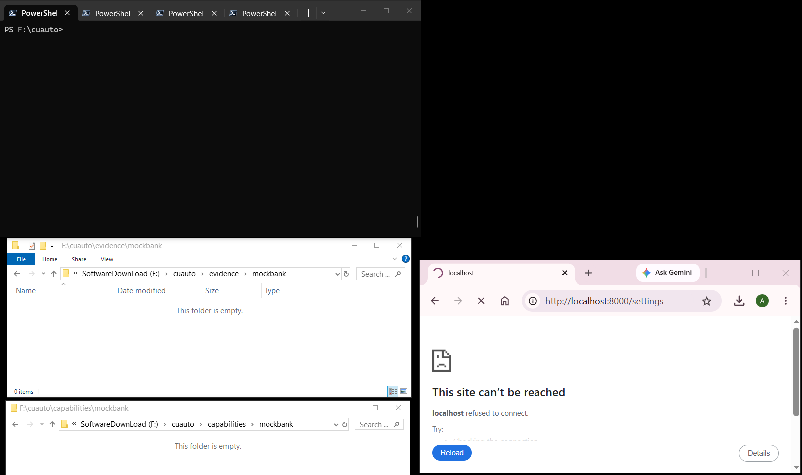
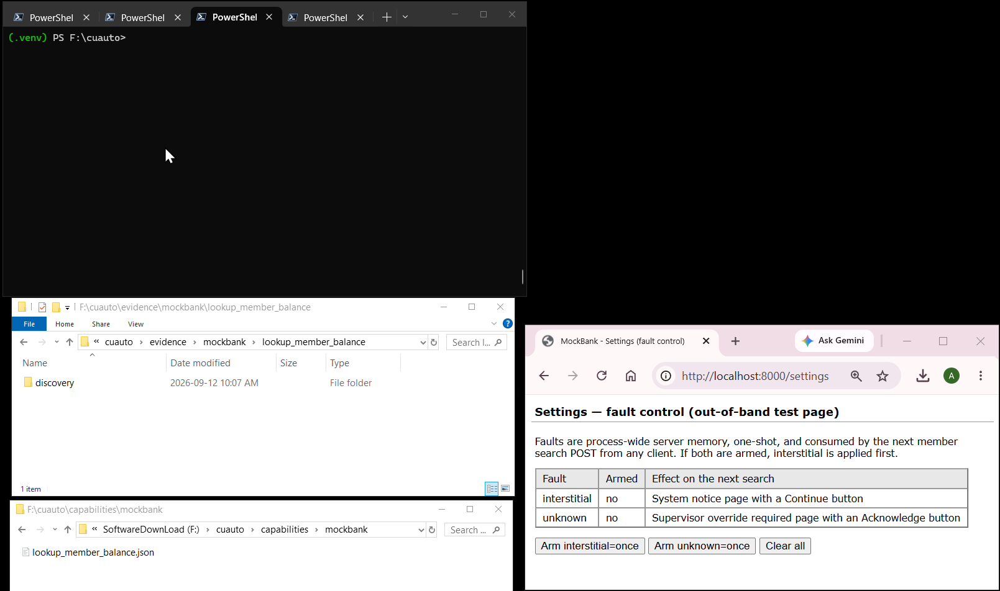
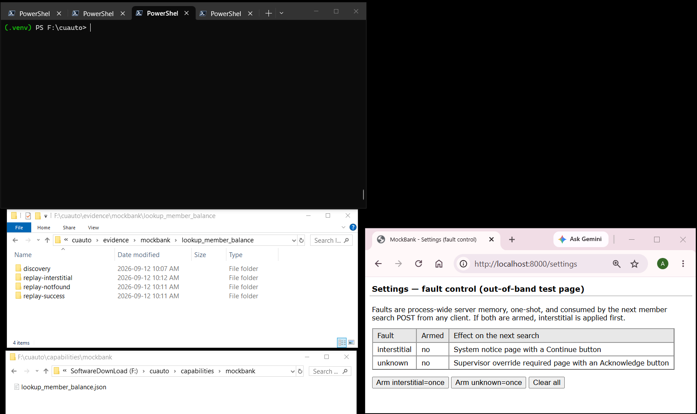

# Computer-use automation: goal-driven discovery, frozen capabilities, deterministic replay

A small, complete vertical slice of a computer-use automation (CUA) system:

> natural-language goal -> real LLM discovery -> typed capability artifact -> lightweight capability catalog -> 0-LLM deterministic replay -> explicit runtime outcomes -> same-session human handoff -> reviewer evidence

`docs/spec.md` is the implementation contract; `REPORT.md` is the design write-up. The demo target is
**MockBank**, a local synthetic legacy banking UI (iframe shell, table layout, server-rendered pages,
no test IDs) with a `Member ID -> Search -> Member Detail` flow.

## Two paths

```text
Capability creation (authoring, LLM allowed)
  app + capability_id + goal + example params
      -> cua discover        real LLM observe/decide/act on the live UI
      -> Artifact Compiler   deterministic code
      -> capabilities/mockbank/lookup_member_balance.json
      -> Capability Catalog  metadata projected from the artifact (no second registry)

Production invocation (0 LLM decisions inside CUA)
  user intent
      -> upstream agent / workflow reads the Catalog and chooses app + capability + args
      -> cua replay          exact (app, capability_id) lookup, deterministic execution
      -> MockBank UI
```

### Capability creation



Genuine LLM discovery against the live MockBank UI, compiled immediately into a typed artifact. Note the Savings target in the emitted JSON: a structural `table_cell` anchored on the row label, never the balance text.

### Production invocation



Zero LLM decisions. Three runs: success, an expected business outcome (`MEMBER_NOT_FOUND`, which is not a failure), and deterministic recovery from the System notice interstitial — the event log shows Search clicked once and Continue once, so the recovery repairs state without replaying the business action.

### Same-session human handoff



The Supervisor override page is not a known recovery, so Replay stops rather than guessing, writes a masked screenshot, and hands the same live browser to a human. After the human acknowledges, Continue revalidates the step contract — it does not repeat Search — and ownership returns to automation for a `success` result.

**Replay never interprets natural language.** An upstream agent (which may itself use an LLM, and is
outside this take-home) selects a capability from the Catalog. Replay receives the already-selected
capability and its parameters and executes it with zero LLM decisions: exact locator resolution,
bounded waiting, postcondition and final-success verification, and a typed result. There is no
LLM routing, no LLM fallback, and no model client import anywhere in the replay path.

**Everything except genuine discovery works without `ANTHROPIC_API_KEY`.** The committed artifact
`capabilities/mockbank/lookup_member_balance.json` is the source of truth; the Catalog, every `cua replay`
variant, the headed HITL demo, and the full test suite run from it with no model credentials.

## Setup (Windows, project-local .venv)

All commands run through the project's own virtual environment. Nothing is installed globally.

```bat
python -m venv .venv                                   :: only if .venv does not exist yet
.venv\Scripts\python.exe -m pip install -e ".[dev]"
.venv\Scripts\python.exe -m playwright install chromium
```

<details>
<summary>macOS / Linux</summary>

```bash
python3 -m venv .venv
source .venv/bin/activate
python -m pip install -e ".[dev]"
python -m playwright install --with-deps chromium
```

With the environment activated, every `.venv\Scripts\cua.exe` below is just `cua`, `.venv\Scripts\python.exe` is `python`, and the `^` line continuations become `\`.

</details>

The third line is run through the project interpreter so the downloaded browser revision matches the installed Playwright package. The browser binary itself lands in the OS-level Playwright cache, not inside `.venv`.

Set `PYTHONUTF8=1` in the shell you use (`set PYTHONUTF8=1` in cmd, `$env:PYTHONUTF8=1` in PowerShell).

Environment variables — set these in your shell; `.env.example` documents them but is not loaded automatically (there is no dotenv dependency):

| Variable | Needed by | Purpose |
|---|---|---|
| `ANTHROPIC_API_KEY` | `cua discover` only | genuine LLM Discovery |
| `CUA_MODEL` | `cua discover` only | Anthropic model id; the actual value is recorded in discovery `meta.json` |
| `MOCKBANK_BASE_URL` | optional | override the MockBank entry URL/origin from `config/apps/mockbank.yaml` |

The commands below are written for `cmd.exe` (`^` is the line continuation). In PowerShell use a
backtick instead of `^` and `curl.exe` instead of `curl`.

## Demo path

### 1. Start MockBank

In its own terminal (leave it running):

```bat
.venv\Scripts\python.exe -m mockbank.app
```

Open http://localhost:8000/ to browse it by hand: Members -> enter Member ID -> Search -> Member Detail.
Synthetic data only: `12345` is a valid member with a known savings balance, `99999` shows
"No member found". Member search is a POST; the member ID never appears in a URL.

http://localhost:8000/settings is an out-of-band fault-control page. It is never automation-allowed
(Policy denies the route). Faults are process-wide server memory, one-shot, and consumed by the next
member search POST from any client.

### 2. List the Catalog

```bat
.venv\Scripts\cua.exe capabilities list --app mockbank
```

Prints one line per capability artifact found under `capabilities/`, e.g.

```text
mockbank  lookup_member_balance  rev=1  inputs=member_id:string  outputs=savings_balance:money  Look up member balance.
```

### 3. Real LLM Discovery (needs `ANTHROPIC_API_KEY`)

```bat
set ANTHROPIC_API_KEY=sk-ant-...
set CUA_MODEL=claude-sonnet-4-6

.venv\Scripts\cua.exe discover ^
  --app mockbank ^
  --capability lookup_member_balance ^
  --goal "Look up the member identified by {member_id} and read the current savings balance" ^
  --param member_id:string=12345 ^
  --max-steps 12 ^
  --timeout 60 ^
  --evidence-dir evidence/mockbank/lookup_member_balance/discovery
```

The goal keeps its `{member_id}` placeholder. The model is given parameter names and types, never the
raw value; every persisted string is sanitized to tokens such as `[REDACTED:member_id]`. A successful
run compiles the artifact to `capabilities/mockbank/lookup_member_balance.json` and writes `meta.json`
(model, message ids, token usage, stop reason), `events.jsonl` and a copy of the artifact to the
evidence directory. Note that this exact command **overwrites the committed golden artifact and
discovery evidence**; omit `--evidence-dir` to write to `.cua-out/<timestamp>/` instead, and pass
`--capabilities-dir <other dir>` to keep the committed artifact untouched.

### 4. Show the Catalog entry

```bat
.venv\Scripts\cua.exe capabilities show --app mockbank --capability lookup_member_balance
```

```json
{
  "app": "mockbank",
  "capability_id": "lookup_member_balance",
  "description": "Look up member balance.",
  "revision": 1,
  "inputs": {"member_id": "string"},
  "outputs": {"savings_balance": "money"}
}
```

### 5. Replay: success

```bat
.venv\Scripts\cua.exe replay ^
  --app mockbank ^
  --capability lookup_member_balance ^
  --param member_id=12345 ^
  --evidence-dir evidence/mockbank/lookup_member_balance/replay-success
```

Result kind `success`; the runtime result carries the parsed savings balance, while the persisted
`result.json` holds `{"redacted": true, "type": "money"}` for it. `llm_calls` is `0`.

### 6. Replay: expected business outcome

```bat
.venv\Scripts\cua.exe replay ^
  --app mockbank ^
  --capability lookup_member_balance ^
  --param member_id=99999 ^
  --evidence-dir evidence/mockbank/lookup_member_balance/replay-notfound
```

Result kind `business_outcome` with code `MEMBER_NOT_FOUND`. This is not a failure: the app answered
correctly, and the artifact declares that outcome.

### 7. Replay: deterministic recovery (interstitial)

First arm the one-shot `interstitial=once` fault on the `/settings` page. Either open
http://localhost:8000/settings in a browser and click **Arm interstitial=once**, or from a shell:

```bat
curl -X POST -d interstitial=once http://localhost:8000/settings
```

Then replay the valid member:

```bat
.venv\Scripts\cua.exe replay ^
  --app mockbank ^
  --capability lookup_member_balance ^
  --param member_id=12345 ^
  --evidence-dir evidence/mockbank/lookup_member_balance/replay-interstitial
```

The Search POST is answered by a "System notice" page. Replay recognizes it through the artifact's
known recovery `DISMISS_SYSTEM_NOTICE`, clicks Continue, re-observes, and settles on Member Detail
without re-clicking Search. Result kind is still `success`, with `recovery_count: 1` and a `recovery`
event in `events.jsonl`.

### 8. Headed HITL replay (same live session)

Arm the `unknown=once` fault, which produces a "Supervisor override required" page that the artifact
does **not** know how to recover from:

```bat
curl -X POST -d unknown=once http://localhost:8000/settings
```

Then run headed, which opens a visible browser and enables handoff:

```bat
.venv\Scripts\cua.exe replay ^
  --app mockbank ^
  --capability lookup_member_balance ^
  --param member_id=12345 ^
  --headed ^
  --evidence-dir evidence/mockbank/lookup_member_balance/replay-hitl
```

After clicking Search the step postcondition ("Savings" visible) does not settle within the bounded
window, so Replay stops with `POSTCONDITION_FAILED`, writes a masked screenshot, and hands ownership of
the **same** browser window to you (`AUTOMATION -> NEEDS_HUMAN -> HUMAN`). The console prints the
sanitized intervention record and prompts:

```text
[R] Retry   [C] Continue   [A] Abort
```

Click **Acknowledge** in the browser window, then type `C` and press Enter. Continue does not repeat
Search; it re-observes and re-runs the same bounded settle, finds Member Detail, reads the balance,
verifies final success, and ends with result kind `success`. Ownership returns
`HUMAN -> AUTOMATION -> COMPLETED`. Your click and the resulting navigation are recorded in
`human-events.jsonl` in sanitized form (input values are never persisted).

The committed `replay-hitl` evidence intentionally shows the stricter two-handoff case: the first Continue is pressed before the page is repaired, revalidation correctly fails, and the session is handed back; the second Continue succeeds after the human fixes the state. REPORT.md section 5 explains why this is the more informative demonstration — Continue revalidates rather than skips.

`R` re-resolves the step target and re-executes the step action through Policy before settling again;
`A` returns result kind `aborted`.

The same stuck state in a normal headless run returns result kind `failure` with
`escalation: "unavailable_headless"` instead of blocking on a console prompt.

## Evidence

Ordinary runs write `meta.json`, `events.jsonl` and `result.json` to `.cua-out/<timestamp>/`
(gitignored). Only the explicit `--evidence-dir evidence/...` commands above write the committed
reviewer evidence under `evidence/mockbank/lookup_member_balance/` (see `evidence/README.md`). All
persisted text is sanitized: no raw member ID or balance appears in any artifact or evidence file, and
failure/HITL screenshots are persisted only after opaque masking of known sensitive controls.

## Tests

```bat
.venv\Scripts\python.exe -m pytest -q
```

Tests start their own MockBank on a random free port (the `mockbank_server` fixture in
`tests/conftest.py`); no manually started server is needed. No test requires an API key, and tests
write evidence only to pytest `tmp_path`, never to the committed `evidence/` tree. Genuine Discovery is
exercised manually (its evidence is committed under `evidence/.../discovery/`) rather than by an
automated test that would call a paid API on every run, which is why the suite reports zero skipped tests.

## Layout

```text
config/apps/mockbank.yaml   authored app config: entry URL, allowlist, risk rules, business outcomes, recoveries
mockbank/                   the synthetic legacy target app (FastAPI + Jinja2 templates)
src/cua/                    the CUA engine and `cua` CLI
capabilities/               compiled capability artifacts, <app>/<capability_id>.json (source of truth)
evidence/                   committed reviewer evidence (see evidence/README.md)
tests/                      unit and integration tests
docs/spec.md                the implementation contract
REPORT.md                   design report (architecture, schema, determinism, handoff, safety, cuts)
```
